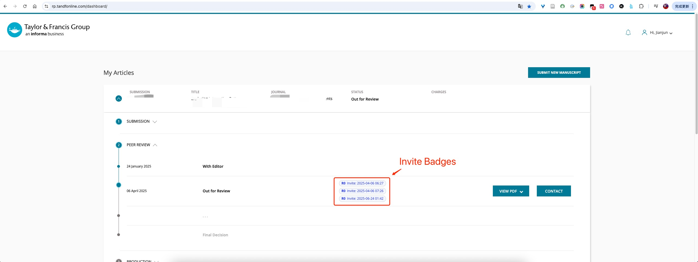

# T&F Dashboard Reviewer Invite Badges

A userscript that displays reviewer invite badges next to "Out for Review" status in Taylor & Francis Dashboard submission cards.

## Purpose

This userscript enhances the T&F Dashboard by automatically showing reviewer invitation timestamps and revision numbers directly in the interface. It helps authors quickly see when reviewers were invited for each submission round.

## Badge Format

Each badge displays: `R{revision} Invite: YYYY-MM-DD HH:mm`

Examples:
- `R0 Invite: 2024-04-06 14:27`
- `R1 Invite: 2025-01-03 11:21`

## Installation

### Quick Install (Recommended)
1. **[Install directly from Greasy Fork](https://greasyfork.org/zh-CN/scripts/545460-t-f-dashboard-reviewer-invite-badges)**
2. Your userscript manager (Tampermonkey/Greasemonkey) will handle the installation automatically

### Manual Installation

#### Tampermonkey (Chrome/Edge)
1. Install [Tampermonkey extension](https://chrome.google.com/webstore/detail/tampermonkey/dhdgffkkebhmkfjojejmpbldmpobfkfo)
2. Copy the contents of `main.js`
3. Create a new userscript in Tampermonkey and paste the code
4. Save and enable the script

#### Greasemonkey (Firefox)
1. Install [Greasemonkey extension](https://addons.mozilla.org/en-US/firefox/addon/greasemonkey/)
2. Copy the contents of `main.js`  
3. Create a new userscript in Greasemonkey and paste the code
4. Save and enable the script

## Usage

1. Install the userscript using one of the methods above
2. Visit the Taylor & Francis Dashboard: `https://rp.tandfonline.com/dashboard`
3. Expand any submission card with "Out for Review" status
4. Reviewer invite badges will automatically appear next to the status text

## Compatibility

- ✅ Chrome with Tampermonkey
- ✅ Firefox with Greasemonkey  
- ✅ Edge with Tampermonkey
- ✅ Other browsers with userscript manager support

## License

MIT License